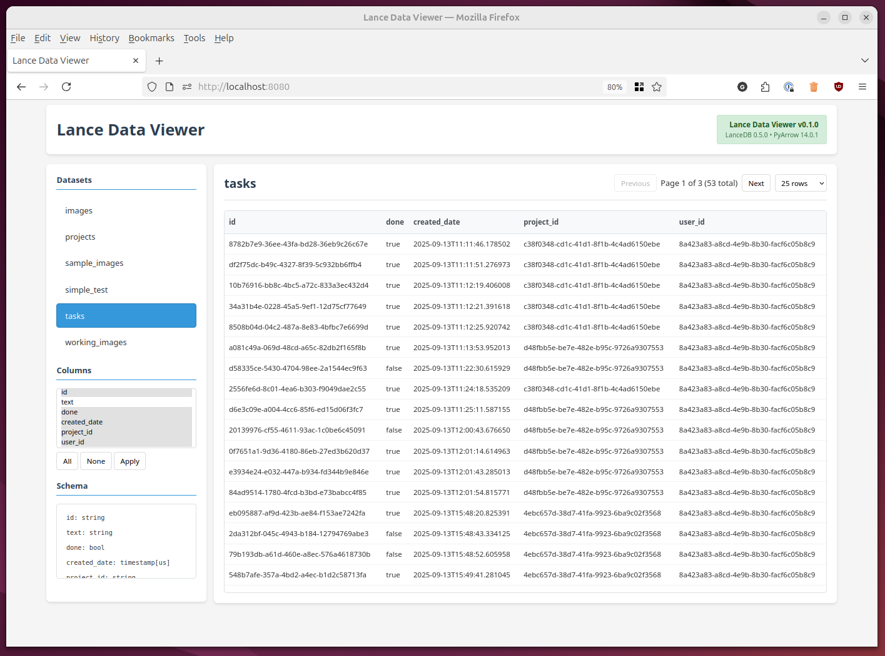

# Lance Data Viewer - A read-only web UI for Lance datasets

Browse Lance tables from your local machine in a simple web UI. No database to set up. Mount a folder and go.

**✨ Multi-Version Support**: Built for different Lance versions to ensure compatibility with your data format.



### Quick start (Docker)

1. **Pull the recommended version**

```bash
# Modern stable version (recommended for new projects)
docker pull ghcr.io/gordonmurray/lance-data-viewer:lancedb-0.24.3
```

2. **Make your data readable (required)**

```bash
# Make your Lance data directory and all contents readable by the container
chmod -R o+rx /path/to/your/lance
```

3. **Run (mount your data)**

```bash
docker run --rm -p 8080:8080 \
    -v /path/to/your/lance:/data:ro \
    ghcr.io/gordonmurray/lance-data-viewer:lancedb-0.24.3
```

4. **Open the UI**

```
http://localhost:8080
```

The UI will display the Lance version in the top-right corner for easy identification.

### What counts as "Lance data" here?

A folder containing Lance tables (as created by Lance/LanceDB). The app lists tables under `/data`.

## Available Lance Versions

Choose the container that matches your Lance data format:

| Container Tag | Lance Version | PyArrow | Use Case |
|--------------|---------------|---------|----------|
| `lancedb-0.24.3` | 0.24.3 | 21.0.0 | **Recommended** - Modern stable version |
| `lancedb-0.16.0` | 0.16.0 | 16.1.0 | Anchor stable for older datasets |
| `lancedb-0.5` | 0.5.0 | 14.0.1 | Legacy support |
| `lancedb-0.3.4` | 0.3.4 | 14.0.1 | Legacy support |
| `lancedb-0.3.1` | 0.3.1 | 14.0.1 | Legacy support |

### Viewing older Lance data

If you have datasets created with older Lance versions:

```bash
# For datasets created with Lance 0.16.x
docker run --rm -p 8080:8080 \
    -v /path/to/your/old/lance/data:/data:ro \
    ghcr.io/gordonmurray/lance-data-viewer:lancedb-0.16.0

# For very old datasets (Lance 0.3.x era)
docker run --rm -p 8080:8080 \
    -v /path/to/your/legacy/data:/data:ro \
    ghcr.io/gordonmurray/lance-data-viewer:lancedb-0.3.4
```

**Tip**: If you're unsure which version to use, start with `lancedb-0.24.3` and if you get compatibility errors, try progressively older versions.

### Features

- **Read-only browsing** with organized left sidebar (Datasets → Columns → Schema)
- **Advanced vector visualization** with CLIP embedding detection and sparkline charts
- **Schema analysis** with vector column highlighting and type detection
- **Server-side pagination** with inline controls and column filtering
- **Robust error handling** - gracefully handles corrupted datasets
- **Responsive layout** optimized for data viewing

### Configuration (optional)

- **Port:** change host port with `-p 9000:8080`.
- **Read-only mount:** keep `:ro` to avoid accidental writes in future versions.

### Images & registries

- **GitHub Container Registry** (`ghcr.io/gordonmurray/lance-data-viewer:TAG`).

### Build and test locally

```bash
# Build with specific Lance version (default: 0.3.4)
docker build -f docker/Dockerfile \
    --build-arg LANCEDB_VERSION=0.24.3 \
    -t lance-data-viewer:dev .

# Build multiple versions for testing
docker build -f docker/Dockerfile --build-arg LANCEDB_VERSION=0.24.3 -t lance-data-viewer:lancedb-0.24.3 .
docker build -f docker/Dockerfile --build-arg LANCEDB_VERSION=0.16.0 -t lance-data-viewer:lancedb-0.16.0 .
docker build -f docker/Dockerfile --build-arg LANCEDB_VERSION=0.3.4 -t lance-data-viewer:lancedb-0.3.4 .

# Make your Lance data readable (one-time setup)
chmod -R o+rx data

# Run with your data (replace 'data' with your lance folder path)
docker run --rm -p 8080:8080 -v $(pwd)/data:/data:ro lance-data-viewer:dev

# Open the web interface
open http://localhost:8080

# Test the API endpoints
curl http://localhost:8080/healthz
curl http://localhost:8080/datasets
curl "http://localhost:8080/datasets/your-dataset/rows?limit=5"
```

### Development workflow

```bash
# Stop any running containers
docker ps -q | xargs docker stop

# Rebuild after code changes (with specific Lance version)
docker build -f docker/Dockerfile \
    --build-arg LANCEDB_VERSION=0.24.3 \
    -t lance-data-viewer:dev .

# Run in background
docker run --rm -d -p 8080:8080 -v $(pwd)/data:/data:ro lance-data-viewer:dev

# View logs
docker logs $(docker ps -q --filter ancestor=lance-data-viewer:dev)

# Check version info
curl http://localhost:8080/healthz | jq '.lancedb_version'
```

## Supported Data Types

### ✅ Fully Supported
- **Standard types**: string, int, float, timestamp, boolean, null
- **Modern vectors**: `Vector(dim)` fields (LanceDB 2024+ style)
- **Fixed-size vectors**: `fixed_size_list<item: float>[N]` (e.g., CLIP-512)
- **Structured data**: nested objects, metadata fields
- **Indexed datasets**: properly created with IVF/HNSW indexes

### ⚠️ Limited Support
- **Legacy vectors**: `pa.list_(pa.float32(), dim)` - schema only, may show corruption warnings
- **Large vectors**: >2048 dimensions show preview only
- **Corrupted data**: graceful degradation with informative error messages

### ❌ Not Supported
- Binary vectors (uint8 arrays)
- Multi-vector columns
- Custom user-defined types
- Write operations (read-only viewer)

## Vector Visualization Features

The viewer provides advanced visualization for vector embeddings:

- **CLIP Detection**: Automatically identifies 512-dimensional CLIP embeddings
- **Statistics**: Shows norm, sparsity, positive ratio, normalization status
- **Sparkline Charts**: Interactive visual representation of vector values
- **Detailed Tooltips**: Hover for comprehensive vector analysis
- **Model Badges**: Visual indicators for recognized embedding types

### Security Notes

- Container runs as non-root
- No authentication; bind to localhost during development and run behind a reverse proxy if exposing
- Read-only access prevents accidental data modification